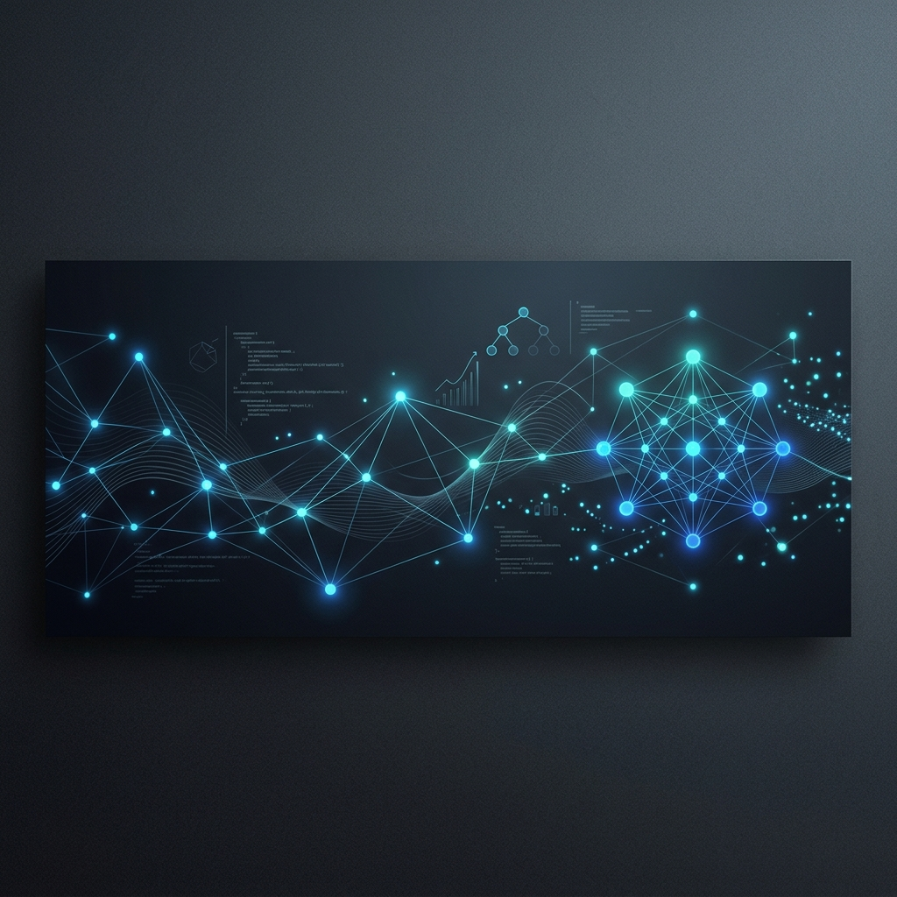

<!-- AUTOMATICALLY GENERATED - PREMIUM GITHUB PROFILE -->
<p align="center">
  
</p>

<h1 align="center">Het Kikani</h1>
<p align="center">
  <strong>Machine Learning Engineer & Full-Stack Developer</strong>
</p>

<p align="center">
  
</p>

<p align="center">
  <a href="https://www.linkedin.com/in/het-kikani-67817236b/"></a>
  <a href="mailto:hetkikani880@gmail.com"></a>
  <a href="https://leetcode.com/u/hetkikani990/"></a>
  <a href="https://x.com/kikanihet"></a>
</p>

---

### 📂 Profile Directory
```text
├── assets/
│   ├── hero_banner.png          # Premium AI/ML Theme Banner
│   └── icons/                   # Custom Local Tech & Section Icons
├── README.md                    # Main Profile File
├── DESIGN.md                    # Personal Branding & Specs
└── CONFIGURATION.md             # Customization & Configuration Guides
```

---

### 🔭 About Me
I am a **Machine Learning Engineer and Full-Stack Developer** dedicated to building high-performance intelligence pipelines and user experiences. My focus lies at the intersection of robust algorithmic modeling and production-scale software delivery. I believe that engineering excellence is born from the combination of theoretical precision and clean, maintainable systems code.

*   **Current Focus**: Distributed deep learning, LLM fine-tuning, RAG systems, and high-performance backend development.
*   **Engineering Philosophy**: Keep architectures decoupled, write clean testable code, and deploy with strict CI/CD guidelines.
*   **Looking to Collaborate**: Scalable MLOps architecture, open-source LLM tools, and advanced data visualization libraries.

---

### 🛠️ Tech Stack & Capabilities

<table>
  <tr>
    <td valign="top" width="50%">
      <strong>🧠 Artificial Intelligence & ML</strong><br/>
      <code>PyTorch</code> <code>TensorFlow</code> <code>Keras</code> <code>scikit-learn</code> <code>FastAPI</code> <code>OpenCV</code> <code>MLflow</code> <code>NumPy</code> <code>Pandas</code>
    </td>
    <td valign="top" width="50%">
      <strong>💻 Languages & Core</strong><br/>
      <code>Python</code> <code>JavaScript</code> <code>Java</code> <code>C / C++</code> <code>Dart</code> <code>SQL</code> <code>PowerShell</code> <code>Bash</code>
    </td>
  </tr>
  <tr>
    <td valign="top" width="50%">
      <strong>🌐 Web & Systems</strong><br/>
      <code>React.js</code> <code>Next.js</code> <code>Node.js</code> <code>Django</code> <code>Flask</code> <code>Flutter</code> <code>Express.js</code> <code>TailwindCSS</code> <code>Vite</code>
    </td>
    <td valign="top" width="50%">
      <strong>🗄️ Infrastructure & Cloud</strong><br/>
      <code>Docker</code> <code>Supabase</code> <code>Firebase</code> <code>Google Cloud</code> <code>Postgres</code> <code>MongoDB</code> <code>MySQL</code> <code>Git</code>
    </td>
  </tr>
</table>

---

### 💻 Featured Projects (Bento Showcase)

<table>
  <tr>
    <td width="50%" valign="top">
      <h4>🌌 LLM Orchestrator</h4>
      <p>An intelligent agent execution framework for managing multi-agent RAG tasks and document workflows.</p/>
      <code>Python</code> <code>LangChain</code> <code>FastAPI</code> <code>Docker</code><br/>
      <a href="https://github.com/Hetk8406">Codebase</a> | <a href="#">Live Demo</a>
    </td>
    <td width="50%" valign="top">
      <h4>📈 Distributed Pipeline</h4>
      <p>A real-time distributed data processing engine built on top of Kafka and Redis for high-throughput messaging.</p/>
      <code>Java</code> <code>Kafka</code> <code>Redis</code> <code>Kubernetes</code><br/>
      <a href="https://github.com/Hetk8406">Codebase</a> | <a href="#">Live Demo</a>
    </td>
  </tr>
  <tr>
    <td width="50%" valign="top">
      <h4>⚡ Vision Analyzer</h4>
      <p>Edge-optimized computer vision system for real-time object tracking and segmentation.</p/>
      <code>Python</code> <code>PyTorch</code> <code>OpenCV</code> <code>C++</code><br/>
      <a href="https://github.com/Hetk8406">Codebase</a> | <a href="#">Live Demo</a>
    </td>
    <td width="50%" valign="top">
      <h4>🛡️ Cloud Shield</h4>
      <p>A zero-trust authentication and authorization server configured for cloud microservices.</p/>
      <code>Go</code> <code>gRPC</code> <code>Postgres</code> <code>OAuth2</code><br/>
      <a href="https://github.com/Hetk8406">Codebase</a> | <a href="#">Live Demo</a>
    </td>
  </tr>
  <tr>
    <td width="50%" valign="top">
      <h4>🧩 Model Predictor</h4>
      <p>Autoscaling ML inference engine serving deep learning predictions with under 50ms latency.</p/>
      <code>Python</code> <code>ONNX</code> <code>Triton</code> <code>GCP</code><br/>
      <a href="https://github.com/Hetk8406">Codebase</a> | <a href="#">Live Demo</a>
    </td>
    <td width="50%" valign="top">
      <h4>🎨 Studio Canvas</h4>
      <p>A web-based collaborative whiteboarding tool featuring vector editing and real-time state sync.</p/>
      <code>TypeScript</code> <code>React</code> <code>WebSockets</code> <code>Vite</code><br/>
      <a href="https://github.com/Hetk8406">Codebase</a> | <a href="#">Live Demo</a>
    </td>
  </tr>
  <tr>
    <td width="50%" valign="top">
      <h4>🧠 Neural Graph</h4>
      <p>Interactive graph neural network visualizer designed to analyze embedding space dynamics.</p/>
      <code>Python</code> <code>PyTorch Geometric</code> <code>Next.js</code> <code>D3</code><br/>
      <a href="https://github.com/Hetk8406">Codebase</a> | <a href="#">Live Demo</a>
    </td>
    <td width="50%" valign="top">
      <h4>🔗 Agent Ledger</h4>
      <p>Secure metadata storage ledger for recording transactional decisions made by autonomous AI agents.</p/>
      <code>Rust</code> <code>SQLite</code> <code>Web3.js</code> <code>gRPC</code><br/>
      <a href="https://github.com/Hetk8406">Codebase</a> | <a href="#">Live Demo</a>
    </td>
  </tr>
</table>

---

### 📊 Analytics & Activity

<p align="center">
  
  
</p>

<p align="center">
  
</p>

<p align="center">
  
</p>

---

<p align="center">
  <a href="https://visitcount.itsvg.in">
    
  </a>
</p>
